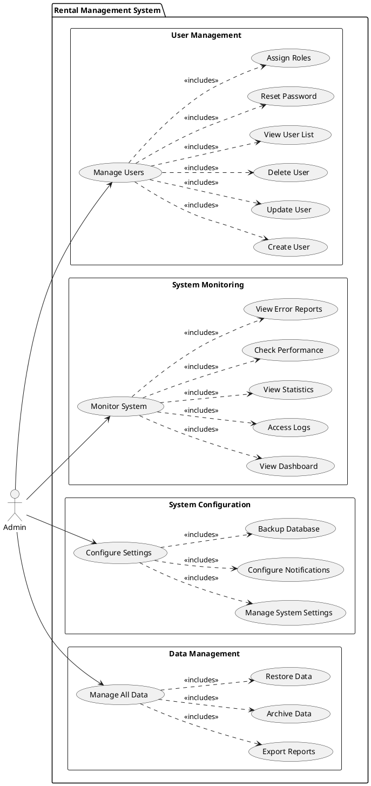
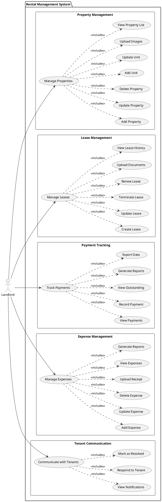
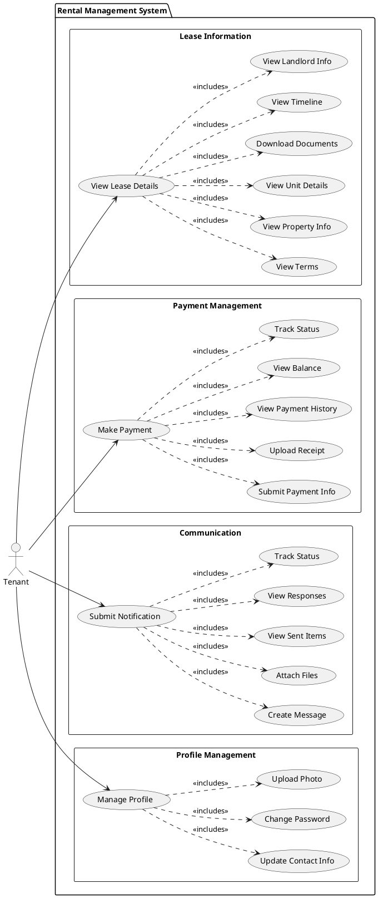
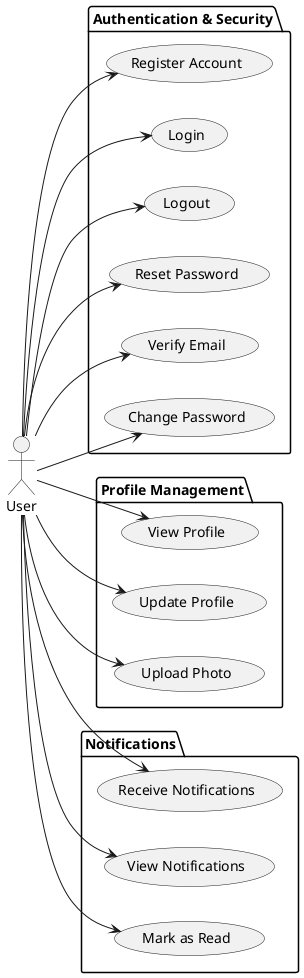

# User Stories and Use Case Diagrams
## Rental Management System

This document contains detailed user stories for each feature in the Rental Management System, organized by user role. Each section includes PlantUML use case diagrams that can be rendered at http://www.plantuml.com/plantuml/

---

## Table of Contents

1. [Admin User Stories](#admin-user-stories)
2. [Landlord User Stories](#landlord-user-stories)
3. [Tenant User Stories](#tenant-user-stories)
4. [System User Stories](#system-user-stories)

---

## Admin User Stories

### Use Case Diagram: Admin Role

---

### User Story A-001: Create User Account

**As an** Admin  
**I want to** create new user accounts in the system  
**So that** authorized users can access the rental management platform

**Priority:** High  
**Story Points:** 3  
**Sprint:** 1

**Acceptance Criteria:** See AC-A001.2 in ACCEPTANCE_CRITERIA.md

**Tasks:**
- [ ] Design user creation form UI
- [ ] Implement form validation
- [ ] Create API endpoint for user creation
- [ ] Implement password hashing
- [ ] Add email uniqueness check
- [ ] Write unit tests
- [ ] Write integration tests

**Dependencies:** None

**Notes:** Initial user (admin) must be created via command line or database seeding.

---

### User Story A-002: Update User Information

**As an** Admin  
**I want to** update existing user account information  
**So that** I can keep user records accurate and current

**Priority:** High  
**Story Points:** 3  
**Sprint:** 1

**Acceptance Criteria:** See AC-A001.3 in ACCEPTANCE_CRITERIA.md

**Tasks:**
- [ ] Design user edit form UI
- [ ] Implement form pre-population with current data
- [ ] Create API endpoint for user updates
- [ ] Implement audit logging
- [ ] Prevent self-demotion for admins
- [ ] Write unit tests

---

### User Story A-003: Delete User Account

**As an** Admin  
**I want to** delete user accounts  
**So that** I can remove inactive or unauthorized users from the system

**Priority:** Medium  
**Story Points:** 2  
**Sprint:** 2

**Acceptance Criteria:** See AC-A001.4 in ACCEPTANCE_CRITERIA.md

**Tasks:**
- [ ] Implement soft delete functionality
- [ ] Add confirmation dialog
- [ ] Check for related data before deletion
- [ ] Create API endpoint for user deletion
- [ ] Update user list UI to hide deleted users
- [ ] Write unit tests

---

### User Story A-004: View System Dashboard

**As an** Admin  
**I want to** view a system dashboard with key metrics  
**So that** I can monitor system health and usage at a glance

**Priority:** Medium  
**Story Points:** 5  
**Sprint:** 2

**Acceptance Criteria:** See AC-A002.1 in ACCEPTANCE_CRITERIA.md

**Tasks:**
- [ ] Design dashboard layout
- [ ] Create API endpoints for metrics
- [ ] Implement real-time data refresh
- [ ] Add charts and visualizations
- [ ] Implement auto-refresh functionality
- [ ] Write unit tests

---

### User Story A-005: Access System Logs

**As an** Admin  
**I want to** view and filter system logs  
**So that** I can troubleshoot issues and audit system activity

**Priority:** Medium  
**Story Points:** 5  
**Sprint:** 3

**Acceptance Criteria:** See AC-A002.2 in ACCEPTANCE_CRITERIA.md

**Tasks:**
- [ ] Design log viewer UI
- [ ] Implement log filtering
- [ ] Create log search functionality
- [ ] Add export to CSV feature
- [ ] Implement pagination for large log files
- [ ] Write unit tests

---

## Landlord User Stories

### Use Case Diagram: Landlord Role

---

### User Story L-001: Add New Property

**As a** Landlord  
**I want to** add new rental properties to the system  
**So that** I can manage them and make them available for tenants

**Priority:** High  
**Story Points:** 5  
**Sprint:** 1

**Acceptance Criteria:** See AC-L001.1 in ACCEPTANCE_CRITERIA.md

**Tasks:**
- [ ] Design property creation form
- [ ] Implement address validation
- [ ] Create property API endpoint
- [ ] Add property type selection
- [ ] Implement form validation
- [ ] Write unit tests
- [ ] Write integration tests

---

### User Story L-002: Upload Property Images

**As a** Landlord  
**I want to** upload multiple images for each property  
**So that** potential tenants can see what the property looks like

**Priority:** High  
**Story Points:** 5  
**Sprint:** 1

**Acceptance Criteria:** See AC-L001.2 in ACCEPTANCE_CRITERIA.md

**Tasks:**
- [ ] Design image upload UI with drag-and-drop
- [ ] Implement file size validation
- [ ] Implement image format validation
- [ ] Create image upload API endpoint
- [ ] Add image preview functionality
- [ ] Implement image deletion
- [ ] Write unit tests

---

### User Story L-003: Add Units to Property

**As a** Landlord  
**I want to** add multiple rental units to each property  
**So that** I can track individual apartments or rooms separately

**Priority:** High  
**Story Points:** 5  
**Sprint:** 1

**Acceptance Criteria:** See AC-L001.3 in ACCEPTANCE_CRITERIA.md

**Tasks:**
- [ ] Design unit creation form
- [ ] Implement unit number uniqueness check
- [ ] Create unit API endpoint
- [ ] Add numeric validation for rent and size
- [ ] Implement unit status management
- [ ] Write unit tests

---

### User Story L-004: Create Lease Agreement

**As a** Landlord  
**I want to** create lease agreements with tenants  
**So that** I can formalize rental arrangements and track occupancy

**Priority:** High  
**Story Points:** 8  
**Sprint:** 2

**Acceptance Criteria:** See AC-L002.1 in ACCEPTANCE_CRITERIA.md

**Tasks:**
- [ ] Design lease creation form
- [ ] Implement tenant selection dropdown
- [ ] Implement unit availability check
- [ ] Create lease API endpoint
- [ ] Add date validation
- [ ] Implement document upload
- [ ] Update unit status on lease creation
- [ ] Write unit tests

---

### User Story L-005: Upload Lease Documents

**As a** Landlord  
**I want to** upload lease agreement documents  
**So that** both parties have access to the official lease terms

**Priority:** Medium  
**Story Points:** 3  
**Sprint:** 2

**Acceptance Criteria:** See AC-L002.2 in ACCEPTANCE_CRITERIA.md

**Tasks:**
- [ ] Design document upload UI
- [ ] Implement PDF validation
- [ ] Create document API endpoint
- [ ] Add document title field
- [ ] Implement document download
- [ ] Write unit tests

---

### User Story L-006: Terminate Lease

**As a** Landlord  
**I want to** terminate lease agreements before the end date  
**So that** I can handle early move-outs or lease violations

**Priority:** Medium  
**Story Points:** 3  
**Sprint:** 3

**Acceptance Criteria:** See AC-L002.3 in ACCEPTANCE_CRITERIA.md

**Tasks:**
- [ ] Add terminate button to lease details
- [ ] Implement confirmation dialog
- [ ] Add termination reason field
- [ ] Create terminate API endpoint
- [ ] Update unit status on termination
- [ ] Write unit tests

---

### User Story L-007: View Payment List

**As a** Landlord  
**I want to** view all payments for my properties  
**So that** I can track rental income and identify overdue payments

**Priority:** High  
**Story Points:** 5  
**Sprint:** 2

**Acceptance Criteria:** See AC-L003.1 in ACCEPTANCE_CRITERIA.md

**Tasks:**
- [ ] Design payment list UI with table
- [ ] Implement payment sorting
- [ ] Create payment list API endpoint
- [ ] Add status indicators (paid, pending, overdue)
- [ ] Implement pagination
- [ ] Add export to CSV functionality
- [ ] Write unit tests

---

### User Story L-008: Record Manual Payment

**As a** Landlord  
**I want to** manually record payments received outside the system  
**So that** all payment records are complete and accurate

**Priority:** High  
**Story Points:** 3  
**Sprint:** 2

**Acceptance Criteria:** See AC-L003.3 in ACCEPTANCE_CRITERIA.md

**Tasks:**
- [ ] Design payment entry form
- [ ] Implement payment method selection
- [ ] Create payment API endpoint
- [ ] Add receipt upload functionality
- [ ] Link payment to correct lease
- [ ] Update tenant balance
- [ ] Write unit tests

---

### User Story L-009: View Outstanding Balances

**As a** Landlord  
**I want to** see which tenants have outstanding payments  
**So that** I can follow up on overdue rent

**Priority:** High  
**Story Points:** 3  
**Sprint:** 3

**Acceptance Criteria:** See AC-L003.6 in ACCEPTANCE_CRITERIA.md

**Tasks:**
- [ ] Design overdue payment report
- [ ] Calculate days overdue
- [ ] Create overdue API endpoint
- [ ] Highlight overdue payments in red
- [ ] Show total overdue amount
- [ ] Write unit tests

---

### User Story L-010: Add Property Expense

**As a** Landlord  
**I want to** record expenses related to my properties  
**So that** I can track costs and calculate net income

**Priority:** Medium  
**Story Points:** 3  
**Sprint:** 3

**Acceptance Criteria:** See AC-L004.1 in ACCEPTANCE_CRITERIA.md

**Tasks:**
- [ ] Design expense entry form
- [ ] Implement category selection
- [ ] Create expense API endpoint
- [ ] Add amount validation
- [ ] Link expense to property
- [ ] Write unit tests

---

### User Story L-011: Upload Expense Receipt

**As a** Landlord  
**I want to** attach receipts to expense records  
**So that** I have proof of expenses for tax purposes

**Priority:** Medium  
**Story Points:** 3  
**Sprint:** 3

**Acceptance Criteria:** See AC-L004.2 in ACCEPTANCE_CRITERIA.md

**Tasks:**
- [ ] Add file upload to expense form
- [ ] Implement file type validation
- [ ] Create receipt upload API endpoint
- [ ] Add receipt preview/download
- [ ] Write unit tests

---

### User Story L-012: Generate Expense Report

**As a** Landlord  
**I want to** generate expense reports by date range  
**So that** I can analyze costs and prepare tax documents

**Priority:** Low  
**Story Points:** 5  
**Sprint:** 4

**Acceptance Criteria:** See AC-L004.5 in ACCEPTANCE_CRITERIA.md

**Tasks:**
- [ ] Design report parameters form
- [ ] Implement date range filter
- [ ] Create report API endpoint
- [ ] Calculate category totals
- [ ] Add export to PDF functionality
- [ ] Add export to CSV functionality
- [ ] Write unit tests

---

## Tenant User Stories

### Use Case Diagram: Tenant Role

---

### User Story T-001: View My Lease Details

**As a** Tenant  
**I want to** view my current lease agreement details  
**So that** I can understand my rental obligations and rights

**Priority:** High  
**Story Points:** 3  
**Sprint:** 2

**Acceptance Criteria:** See AC-T001.1 in ACCEPTANCE_CRITERIA.md

**Tasks:**
- [ ] Design lease details page
- [ ] Create lease details API endpoint
- [ ] Display property and unit information
- [ ] Show lease dates and amounts
- [ ] Add status indicator
- [ ] Write unit tests

---

### User Story T-002: Download Lease Documents

**As a** Tenant  
**I want to** download my lease agreement and related documents  
**So that** I have a copy for my records

**Priority:** High  
**Story Points:** 2  
**Sprint:** 2

**Acceptance Criteria:** See AC-T001.3 in ACCEPTANCE_CRITERIA.md

**Tasks:**
- [ ] Add document list to lease details page
- [ ] Implement document download API endpoint
- [ ] Add download buttons
- [ ] Handle PDF display in browser
- [ ] Write unit tests

---

### User Story T-003: View Property Information

**As a** Tenant  
**I want to** view detailed information about my rental property  
**So that** I know the features and amenities available

**Priority:** Medium  
**Story Points:** 2  
**Sprint:** 2

**Acceptance Criteria:** See AC-T001.2 in ACCEPTANCE_CRITERIA.md

**Tasks:**
- [ ] Add property section to lease details
- [ ] Display property images
- [ ] Show property description
- [ ] Display unit specifications
- [ ] Write unit tests

---

### User Story T-004: Submit Rent Payment

**As a** Tenant  
**I want to** submit my rent payment information  
**So that** my landlord knows I've paid and can verify the payment

**Priority:** High  
**Story Points:** 5  
**Sprint:** 2

**Acceptance Criteria:** See AC-T002.1 in ACCEPTANCE_CRITERIA.md

**Tasks:**
- [ ] Design payment submission form
- [ ] Implement payment method selection
- [ ] Create payment submission API endpoint
- [ ] Add amount and date validation
- [ ] Show confirmation message
- [ ] Send confirmation email
- [ ] Write unit tests

---

### User Story T-005: Upload Payment Receipt

**As a** Tenant  
**I want to** attach a receipt when submitting payment  
**So that** I have proof of payment on record

**Priority:** Medium  
**Story Points:** 3  
**Sprint:** 2

**Acceptance Criteria:** See AC-T002.2 in ACCEPTANCE_CRITERIA.md

**Tasks:**
- [ ] Add file upload to payment form
- [ ] Implement file validation
- [ ] Create receipt upload API endpoint
- [ ] Show upload progress
- [ ] Allow receipt preview
- [ ] Write unit tests

---

### User Story T-006: View Payment History

**As a** Tenant  
**I want to** view all my past payments  
**So that** I can track my payment record

**Priority:** Medium  
**Story Points:** 3  
**Sprint:** 3

**Acceptance Criteria:** See AC-T002.4 in ACCEPTANCE_CRITERIA.md

**Tasks:**
- [ ] Design payment history page
- [ ] Create payment history API endpoint
- [ ] Implement sorting by date
- [ ] Add status indicators
- [ ] Implement date range filter
- [ ] Write unit tests

---

### User Story T-007: Check Outstanding Balance

**As a** Tenant  
**I want to** see my current outstanding balance  
**So that** I know how much I owe

**Priority:** High  
**Story Points:** 2  
**Sprint:** 2

**Acceptance Criteria:** See AC-T002.5 in ACCEPTANCE_CRITERIA.md

**Tasks:**
- [ ] Add balance display to dashboard
- [ ] Create balance calculation API endpoint
- [ ] Show next payment due date
- [ ] Show next payment amount
- [ ] Highlight if overdue
- [ ] Write unit tests

---

### User Story T-008: Send Notification to Landlord

**As a** Tenant  
**I want to** send messages to my landlord  
**So that** I can report issues or ask questions

**Priority:** High  
**Story Points:** 5  
**Sprint:** 3

**Acceptance Criteria:** See AC-T003.1 in ACCEPTANCE_CRITERIA.md

**Tasks:**
- [ ] Design notification form
- [ ] Implement category selection
- [ ] Create notification API endpoint
- [ ] Add character counter for subject/message
- [ ] Show confirmation after sending
- [ ] Write unit tests

---

### User Story T-009: Attach Files to Notification

**As a** Tenant  
**I want to** attach photos or documents to my messages  
**So that** I can provide visual evidence of issues

**Priority:** Medium  
**Story Points:** 3  
**Sprint:** 3

**Acceptance Criteria:** See AC-T003.2 in ACCEPTANCE_CRITERIA.md

**Tasks:**
- [ ] Add file upload to notification form
- [ ] Implement multi-file selection
- [ ] Validate file types and sizes
- [ ] Create file upload API endpoint
- [ ] Show upload progress
- [ ] Allow file removal before sending
- [ ] Write unit tests

---

### User Story T-010: View Sent Notifications

**As a** Tenant  
**I want to** view all notifications I've sent  
**So that** I can track my communication with my landlord

**Priority:** Medium  
**Story Points:** 3  
**Sprint:** 3

**Acceptance Criteria:** See AC-T003.4 in ACCEPTANCE_CRITERIA.md

**Tasks:**
- [ ] Design sent notifications page
- [ ] Create sent items API endpoint
- [ ] Display list with status
- [ ] Implement click to view details
- [ ] Show response indicator
- [ ] Write unit tests

---

### User Story T-011: View Landlord Responses

**As a** Tenant  
**I want to** view responses from my landlord  
**So that** I know the status of my requests

**Priority:** High  
**Story Points:** 3  
**Sprint:** 3

**Acceptance Criteria:** See AC-T003.6 in ACCEPTANCE_CRITERIA.md

**Tasks:**
- [ ] Design conversation thread UI
- [ ] Create responses API endpoint
- [ ] Display messages chronologically
- [ ] Add email notification for new responses
- [ ] Show read/unread status
- [ ] Write unit tests

---

## System User Stories

### Use Case Diagram: System-Wide Features

---

### User Story S-001: Register New Account

**As a** new user  
**I want to** register for an account  
**So that** I can access the rental management system

**Priority:** High  
**Story Points:** 5  
**Sprint:** 1

**Acceptance Criteria:** See AC-S001.2 in ACCEPTANCE_CRITERIA.md

**Tasks:**
- [ ] Design registration form
- [ ] Implement email validation
- [ ] Implement password strength validation
- [ ] Create registration API endpoint
- [ ] Send verification email
- [ ] Write unit tests

---

### User Story S-002: Login to System

**As a** registered user  
**I want to** login with my credentials  
**So that** I can access my account and features

**Priority:** High  
**Story Points:** 3  
**Sprint:** 1

**Acceptance Criteria:** See AC-S001.1 in ACCEPTANCE_CRITERIA.md

**Tasks:**
- [ ] Design login form
- [ ] Implement credential validation
- [ ] Create login API endpoint
- [ ] Generate JWT token
- [ ] Store token in browser
- [ ] Redirect to appropriate dashboard
- [ ] Write unit tests

---

### User Story S-003: Reset Forgotten Password

**As a** user who forgot their password  
**I want to** reset my password via email  
**So that** I can regain access to my account

**Priority:** High  
**Story Points:** 5  
**Sprint:** 1

**Acceptance Criteria:** See AC-S001.3 in ACCEPTANCE_CRITERIA.md

**Tasks:**
- [ ] Design forgot password form
- [ ] Create password reset request API endpoint
- [ ] Generate secure reset token
- [ ] Send reset email with link
- [ ] Design reset password form
- [ ] Create reset password API endpoint
- [ ] Write unit tests

---

### User Story S-004: Update Profile Information

**As a** logged-in user  
**I want to** update my profile information  
**So that** my contact details are current

**Priority:** Medium  
**Story Points:** 3  
**Sprint:** 2

**Acceptance Criteria:** System validates and saves profile updates

**Tasks:**
- [ ] Design profile edit form
- [ ] Pre-populate with current data
- [ ] Create profile update API endpoint
- [ ] Validate email and phone formats
- [ ] Write unit tests

---

### User Story S-005: Upload Profile Picture

**As a** logged-in user  
**I want to** upload a profile picture  
**So that** my account is more personalized

**Priority:** Low  
**Story Points:** 3  
**Sprint:** 3

**Acceptance Criteria:** Image is validated, uploaded, and displayed

**Tasks:**
- [ ] Add image upload button to profile
- [ ] Implement image cropping
- [ ] Create image upload API endpoint
- [ ] Validate image format and size
- [ ] Display uploaded image
- [ ] Write unit tests

---

## Document Control

**Version:** 1.0  
**Date:** January 12, 2026  
**Status:** Final  
**Author:** Development Team  
**Last Updated:** January 12, 2026

---

## Story Point Reference

- **1 point:** Very simple task, < 4 hours
- **2 points:** Simple task, 4-8 hours
- **3 points:** Moderate task, 1-2 days
- **5 points:** Complex task, 2-3 days
- **8 points:** Very complex task, 3-5 days
- **13 points:** Epic, should be broken down

---

## Priority Levels

- **High:** Critical for MVP, must be in first release
- **Medium:** Important but can be delayed if necessary
- **Low:** Nice to have, can be added in later versions

---

## How to Use This Document

**For Product Owners:**
- Use to plan sprints and prioritize features
- Reference during backlog grooming
- Use story points for velocity planning

**For Developers:**
- Reference during implementation
- Use as basis for creating subtasks
- Link commits to story IDs

**For QA:**
- Create test cases based on acceptance criteria
- Verify each story meets all criteria
- Reference during test planning

---

## Rendering PlantUML Diagrams

To view the use case diagrams:

1. Copy the PlantUML code (including @startuml and @enduml)
2. Visit http://www.plantuml.com/plantuml/
3. Paste the code into the editor
4. The diagram will render automatically
5. Download as PNG or SVG if needed

---

**End of Document**
